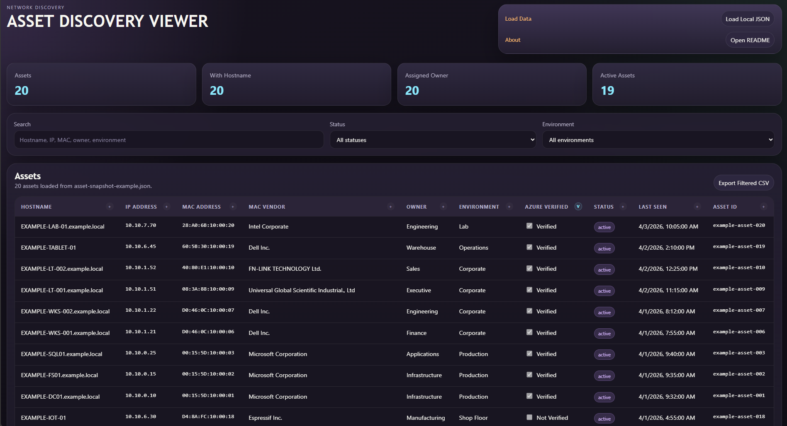

# PowerShell Asset Toolkit

This workspace contains scripts for local network discovery, a SQLite-backed asset database, and Azure verification.

## Files

- `Discover-Network.ps1`: Ping-sweeps a subnet, resolves DNS names when possible, captures ARP MAC addresses, and writes normalized JSON output.
- `Init-AssetDatabase.ps1`: Creates the SQLite database used as the canonical asset store.
- `Import-DiscoveryToDatabase.ps1`: Imports a CSV or JSON discovery file into the SQLite asset database and appends observation history.
- `Export-AssetSnapshot.ps1`: Exports the current canonical asset records from SQLite to JSON for reporting or the viewer.
- `Update-OuiRegistry.ps1`: Downloads and builds a local OUI vendor registry cache from the official IEEE CSV registries.
- `Update-AssetVendors.ps1`: Uses the local OUI registry cache to populate `MacVendor` in the asset database.
- `Get-AssetRecords.ps1`: Queries the canonical asset records from SQLite with optional search and status filters.
- `Update-AssetRecord.ps1`: Updates owner, environment, status, notes, and identity fields for an existing asset.
- `Edit-AssetRecord.ps1`: Search-first maintenance flow that lets you select a matching asset and update it without manually typing the asset ID.
- `Start-Viewer.ps1`: Starts a local web server for the viewer and opens it with snapshot auto-load enabled.
- `Update-AssetInventory.ps1`: Legacy JSON inventory merge workflow retained for compatibility.
- `Verify-AzureAssets.ps1`: Compares canonical assets against Microsoft Entra device objects in the current Azure login context, updates the `AzureVerified` flag in the database, and exports a verification report.
- `AssetToolkit.psm1`: Shared functions used by the scripts.
- `viewer\`: Static HTML viewer for discovery JSON with summary cards, filters, and exportable tables.
- `db\`: SQLite schema and helper script used by the PowerShell wrappers.

## Expected inventory fields

CSV or JSON input can use these fields directly, or common aliases such as `Name`, `ComputerName`, `IPAddress`, and `MACAddress`.

- `AssetId`
- `Hostname`
- `IpAddress`
- `MacAddress`
- `OperatingSystem`
- `Owner`
- `Environment`
- `Source`
- `LastSeen`
- `Notes`

## Usage

```powershell
.\Discover-Network.ps1 -Subnet 192.168.1 -StartHost 10 -EndHost 25 -NoDns -NoMac -DelayMilliseconds 250 -OutputPath .\output\discovery.json
.\Discover-Network.ps1 -TargetIpAddress 10.1.1.10,10.1.1.11 -NoDns -NoMac -OutputPath .\output\discovery.json
.\\Discover-Network.ps1 -TargetFilePath .\targets\batch1.txt -NoDns -NoMac -DelayMilliseconds 250 -OutputPath .\output\discovery.json
.\Init-AssetDatabase.ps1 -DatabasePath .\data\assets.db
.\Import-DiscoveryToDatabase.ps1 -InputPath .\output\discovery.json -DatabasePath .\data\assets.db
.\\Update-OuiRegistry.ps1 -OutputPath .\data\oui-registry.json
.\\Update-AssetVendors.ps1 -DatabasePath .\data\assets.db -RegistryPath .\data\oui-registry.json
.\\Get-AssetRecords.ps1 -DatabasePath .\data\assets.db -Search UTILITY
.\\Update-AssetRecord.ps1 -DatabasePath .\data\assets.db -AssetId <asset-guid> -Owner "IT Operations" -Environment Production -Status active
.\\Edit-AssetRecord.ps1 -DatabasePath .\data\assets.db -Search UTILITY -Owner "IT Operations" -Environment Production
.\Export-AssetSnapshot.ps1 -DatabasePath .\data\assets.db -OutputPath .\output\asset-snapshot.json
.\\Start-Viewer.ps1
.\Update-AssetInventory.ps1 -SourcePath .\output\discovery.json -InventoryPath .\data\asset-inventory.json
.\Verify-AzureAssets.ps1 -DatabasePath .\data\assets.db
```

## Database model

The SQLite database is the canonical asset store.

- `assets`: One current record per known asset, including `first_seen`, `last_seen`, and current best-known identity fields.
- `discovery_runs`: Metadata for each import event.
- `asset_observations`: Historical sightings captured from each discovery run.

This lets you keep a living asset database over time even when devices are offline, renamed, or only partially identified in a given scan.

For day-to-day maintenance, `Edit-AssetRecord.ps1` is the easiest workflow: search for the asset by hostname, IP, MAC, or owner, choose the match if multiple records are returned, and apply your field updates.

## Identity matching

Discovery imports use stronger identity rules before updating an existing asset:

- `AssetId` exact match
- `MacAddress` exact match
- exact `Hostname` match only when it resolves to a single known asset
- `IpAddress` only for recent unresolved assets that have no hostname or MAC

This avoids treating IP address reuse as a durable identity signal while still allowing short-term continuity for weakly identified devices.

## Vendor enrichment

Vendor lookup is a separate step from discovery.

- `Update-OuiRegistry.ps1` builds a local OUI cache from the official IEEE registries
- `Update-AssetVendors.ps1` updates asset `MacVendor` values from the database MAC addresses
- No hostname-based inference is used for vendor classification

## Azure prerequisites

Install and authenticate Azure PowerShell before running verification:

```powershell
Install-Module Az.Accounts -Scope CurrentUser
Connect-AzAccount
```

The verification script currently compares canonical assets against Microsoft Entra device objects visible in the current Azure login context. Matching is hostname-based against the Entra device display name, including short-hostname fallback for FQDN inventory names.

For larger environments, start with `-TargetIpAddress` or a very small `-StartHost`/`-EndHost` window and keep `-NoDns`, `-NoMac`, and a small `-DelayMilliseconds` value enabled until you confirm the behavior is acceptable.

## Viewer

Open `viewer\index.html` in a browser to review exported asset snapshots as a table.



- The viewer now tries to auto-load `.\output\asset-snapshot.json` on page open.
- `Start-Viewer.ps1` is the preferred way to launch it because it serves the page over `http://localhost`.
- If you open `viewer\index.html` directly and the browser blocks local `fetch`, use the built-in file picker as fallback.
- The viewer is now oriented around maintained asset fields such as owner, environment, status, and last seen.
- It supports search, environment filtering, status filtering, and CSV export of the filtered rows.
