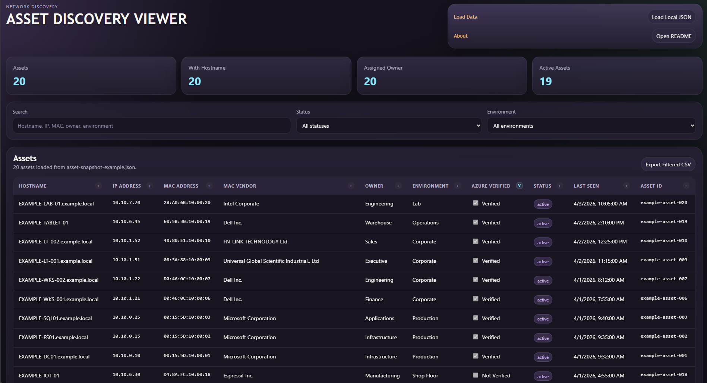

# PowerShell Asset Toolkit

This workspace contains scripts for local network discovery, a SQLite-backed asset database, and Azure verification.

## Files

- `Discover-Network.ps1`: Ping-sweeps a subnet, resolves DNS names when possible, captures ARP MAC addresses, and writes normalized JSON output.
- `Init-AssetDatabase.ps1`: Creates the SQLite database used as the canonical asset store.
- `Import-DiscoveryToDatabase.ps1`: Imports a CSV or JSON discovery file into the SQLite asset database and appends observation history.
- `Compare-NinjaExport.ps1`: Compares a NinjaOne CSV export against the SQLite asset database and writes a review report with strong matches, IP-only review rows, and conflicts.
- `Import-NinjaExportToDatabase.ps1`: Imports a NinjaOne CSV export using MAC and short-hostname matching, while skipping IP-only and conflict rows for review.
- `Repair-BadNinjaMacMerge.ps1`: Repairs Ninja-imported assets that were incorrectly merged under a known bad shared MAC address by reassigning observations to per-device assets.
- `Export-AssetSnapshot.ps1`: Exports the current canonical asset records from SQLite to JSON for reporting or the viewer.
- `Update-OuiRegistry.ps1`: Downloads and builds a local OUI vendor registry cache from the official IEEE CSV registries.
- `Update-AssetVendors.ps1`: Uses the local OUI registry cache to populate `MacVendor` in the asset database.
- `Get-AssetRecords.ps1`: Queries the canonical asset records from SQLite with optional search and status filters.
- `Update-AssetRecord.ps1`: Updates owner, environment, status, notes, and identity fields for an existing asset.
- `Edit-AssetRecord.ps1`: Search-first maintenance flow that lets you select a matching asset and update it without manually typing the asset ID.
- `Invoke-AssetDiscoveryRefresh.ps1`: Runs the recurring refresh cycle: database initialization, Ninja comparison/import, vendor enrichment, Azure verification, and snapshot export.
- `Start-Viewer.ps1`: Starts a local web server for the viewer and opens it with snapshot auto-load enabled.
- `Update-AssetInventory.ps1`: Legacy JSON inventory merge workflow retained for compatibility.
- `New-AssetDiscoveryGraphApp.ps1`: Creates a Microsoft Graph app registration for unattended device reads.
- `Verify-AzureAssets.ps1`: Compares canonical assets against Microsoft Entra device objects using Graph app credentials or the current Azure login context, updates the `AzureVerified` flag in the database, and exports a verification report.
- `AssetToolkit.psm1`: Shared functions used by the scripts.
- `viewer\`: Static HTML viewer for discovery JSON with summary cards, filters, and exportable tables.
- `db\`: SQLite schema and helper script used by the PowerShell wrappers.

## Expected inventory fields

CSV or JSON input can use these fields directly, or common aliases such as `Name`, `ComputerName`, `IPAddress`, and `MACAddress`.

- `AssetId`
- `Hostname`
- `IpAddress`
- `MacAddress`
- `AssetType`
- `OperatingSystem`
- `Owner`
- `Environment`
- `Source`
- `LastSeen`
- `Notes`

## Usage

```powershell
.\Discover-Network.ps1 -Subnet 192.168.1 -StartHost 10 -EndHost 25 -NoDns -NoMac -DelayMilliseconds 250 -OutputPath .\output\discovery.json
.\Discover-Network.ps1 -TargetIpAddress 10.1.1.10,10.1.1.11 -NoDns -NoMac -OutputPath .\output\discovery.json
.\\Discover-Network.ps1 -TargetFilePath .\targets\batch1.txt -NoDns -NoMac -DelayMilliseconds 250 -OutputPath .\output\discovery.json
.\Init-AssetDatabase.ps1 -DatabasePath .\data\assets.db
.\Import-DiscoveryToDatabase.ps1 -InputPath .\output\discovery.json -DatabasePath .\data\assets.db
.\\Compare-NinjaExport.ps1 -InputPath .\NinjaExport.csv -DatabasePath .\data\assets.db -OutputPath .\output\ninja-compare-report.json
.\\Import-NinjaExportToDatabase.ps1 -InputPath .\NinjaExport.csv -DatabasePath .\data\assets.db -ReportPath .\output\ninja-import-report.json
.\\Repair-BadNinjaMacMerge.ps1 -DatabasePath .\data\assets.db -BadMacAddress 00:09:0F:AA:00:01
.\\Update-OuiRegistry.ps1 -OutputPath .\data\oui-registry.json
.\\Update-AssetVendors.ps1 -DatabasePath .\data\assets.db -RegistryPath .\data\oui-registry.json
.\\Get-AssetRecords.ps1 -DatabasePath .\data\assets.db -Search UTILITY
.\\Update-AssetRecord.ps1 -DatabasePath .\data\assets.db -AssetId <asset-guid> -AssetType PC -Owner "IT Operations" -Environment Production -Status active
.\\Edit-AssetRecord.ps1 -DatabasePath .\data\assets.db -Search UTILITY -AssetType PC -Owner "IT Operations" -Environment Production
.\Export-AssetSnapshot.ps1 -DatabasePath .\data\assets.db -OutputPath .\output\asset-snapshot.json
.\\Start-Viewer.ps1
.\Update-AssetInventory.ps1 -SourcePath .\output\discovery.json -InventoryPath .\data\asset-inventory.json
.\Verify-AzureAssets.ps1 -DatabasePath .\data\assets.db
.\Verify-AzureAssets.ps1 -DatabasePath .\data\assets.db -CredentialPath .\data\graph-app-credentials.json
.\Invoke-AssetDiscoveryRefresh.ps1
```

## Database model

The SQLite database is the canonical asset store.

- `assets`: One current record per known asset, including `first_seen`, `last_seen`, and current best-known identity fields.
- `discovery_runs`: Metadata for each import event.
- `asset_observations`: Historical sightings captured from each discovery run.

This lets you keep a living asset database over time even when devices are offline, renamed, or only partially identified in a given scan.

For day-to-day maintenance, `Edit-AssetRecord.ps1` is the easiest workflow: search for the asset by hostname, IP, MAC, or owner, choose the match if multiple records are returned, and apply your field updates.

## Identity matching

Discovery imports use stronger identity rules before updating an existing asset:

- `AssetId` exact match
- `MacAddress` exact match
- exact `Hostname` match only when it resolves to a single known asset
- `IpAddress` only for recent unresolved assets that have no hostname or MAC

This avoids treating IP address reuse as a durable identity signal while still allowing short-term continuity for weakly identified devices.

## Ninja export import

`NinjaExport.csv` is not in the generic discovery schema, so it uses a separate import path.

- `Compare-NinjaExport.ps1` produces a report before import
- matching is strong on MAC address first, then unique short-hostname equivalence against FQDN inventory names
- IP address overlap is treated as a review signal only and is not used as an automatic merge key
- rows with conflicting MAC and IP signals are skipped from import and left in the report for manual review
- multi-adapter rows are reduced to a preferred IPv4 and MAC for canonical storage, while the full candidate lists remain visible in the report
- empty Ninja placeholder rows are ignored before comparison/import when they have no hostname, IP address, MAC address, owner, asset type, or OS. This removes organization/location-only rows such as `Environment=Default Installs` or `Environment=Main Office` with no asset identity.

If older placeholders already exist in the database, remove them and regenerate the viewer snapshot:

```powershell
python .\db\db_tool.py remove-ninja-empty-placeholders --db-path .\data\assets.db
.\Export-AssetSnapshot.ps1 -DatabasePath .\data\assets.db -OutputPath .\output\asset-snapshot.json
```

## Vendor enrichment

Vendor lookup is a separate step from discovery.

- `Update-OuiRegistry.ps1` builds a local OUI cache from the official IEEE registries
- `Update-AssetVendors.ps1` updates asset `MacVendor` values from the database MAC addresses
- No hostname-based inference is used for vendor classification

## Azure verification

Azure verification reads Microsoft Entra devices from Microsoft Graph and matches them to canonical assets by hostname, including short-hostname fallback for FQDN inventory names.

For unattended runs, create a Graph app registration once from an admin Azure session:

```powershell
Install-Module Az.Accounts -Scope CurrentUser
Connect-AzAccount
.\New-AssetDiscoveryGraphApp.ps1 -OutputPath .\data\graph-app-credentials.json
```

The generated app is granted the Microsoft Graph `Device.Read.All` application permission. The credential output is written under `data\`, which is ignored by git. Store the client secret securely and rotate it before expiration.

After the app exists, run verification without an interactive Azure login by passing credentials:

```powershell
.\Verify-AzureAssets.ps1 -DatabasePath .\data\assets.db -CredentialPath .\data\graph-app-credentials.json
```

Or pass the values directly:

```powershell
$secret = ConvertTo-SecureString '<client-secret>' -AsPlainText -Force
.\Verify-AzureAssets.ps1 -DatabasePath .\data\assets.db -TenantId <tenant-id> -ClientId <app-client-id> -ClientSecret $secret
```

You can also use environment variables for scheduled jobs:

```powershell
$env:ASSETDISCOVERY_GRAPH_TENANT_ID = '<tenant-id>'
$env:ASSETDISCOVERY_GRAPH_CLIENT_ID = '<app-client-id>'
$env:ASSETDISCOVERY_GRAPH_CLIENT_SECRET = '<client-secret>'
.\Verify-AzureAssets.ps1 -DatabasePath .\data\assets.db
```

If no Graph app credentials are supplied, `Verify-AzureAssets.ps1` falls back to the current Azure PowerShell context from `Connect-AzAccount`.

For larger environments, start with `-TargetIpAddress` or a very small `-StartHost`/`-EndHost` window and keep `-NoDns`, `-NoMac`, and a small `-DelayMilliseconds` value enabled until you confirm the behavior is acceptable.

## Refresh cycle

`Invoke-AssetDiscoveryRefresh.ps1` is the scheduled refresh entry point. It runs these steps from the repository root:

- initializes or migrates `.\data\assets.db`
- compares and imports `.\NinjaExport.csv` when present
- updates `MacVendor` from `.\data\oui-registry.json` when present
- verifies assets against Microsoft Graph when `.\data\graph-app-credentials.json` exists
- exports `.\output\asset-snapshot.json` for the viewer
- writes a transcript log to `.\output\asset-refresh-YYYYMMDD-HHMMSS.log`

The current Windows Scheduled Task on this machine is named `AssetDiscovery Refresh`. It runs daily at 6:00 AM as the interactive `druggeri` user and executes:

```powershell
powershell.exe -NoProfile -ExecutionPolicy Bypass -File C:\users\druggeri\Scripts\AssetDiscovery\Invoke-AssetDiscoveryRefresh.ps1
```

To recreate or update the task:

```powershell
$taskName = 'AssetDiscovery Refresh'
$scriptPath = 'C:\users\druggeri\Scripts\AssetDiscovery\Invoke-AssetDiscoveryRefresh.ps1'
$workDir = 'C:\users\druggeri\Scripts\AssetDiscovery'
$action = New-ScheduledTaskAction -Execute 'C:\Windows\System32\WindowsPowerShell\v1.0\powershell.exe' -Argument "-NoProfile -ExecutionPolicy Bypass -File `"$scriptPath`"" -WorkingDirectory $workDir
$trigger = New-ScheduledTaskTrigger -Daily -At 6:00AM
$principal = New-ScheduledTaskPrincipal -UserId 'druggeri' -LogonType Interactive -RunLevel Limited
$settings = New-ScheduledTaskSettingsSet -StartWhenAvailable -MultipleInstances IgnoreNew -ExecutionTimeLimit (New-TimeSpan -Hours 2)
Register-ScheduledTask -TaskName $taskName -Action $action -Trigger $trigger -Principal $principal -Settings $settings -Description 'Refresh AssetDiscovery database, Azure verification, and viewer snapshot.' -Force
```

## Viewer

Open `viewer\index.html` in a browser to review exported asset snapshots as a table.



- The viewer now tries to auto-load `.\output\asset-snapshot.json` on page open.
- `Start-Viewer.ps1` is the preferred way to launch it because it serves the page over `http://localhost`.
- If you open `viewer\index.html` directly and the browser blocks local `fetch`, start the viewer with `Start-Viewer.ps1`.
- The viewer is now oriented around maintained asset fields such as owner, environment, status, and last seen.
- The summary cards show asset counts plus the last modified times for the inventory snapshot, Azure verification report, and Ninja export CSV.
- It supports search, environment filtering, status filtering, and CSV export of the filtered rows.
